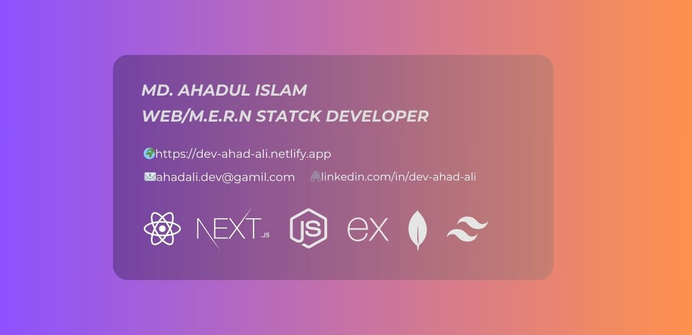

<!-- Banner Image -->

## 🤖 About Me :

A passionate **Programmer** and a equally passionate **Learner**. Currently working as a **Full Stack Web Developer**. Always like to discover thoughtful and exciting technologies and topics. Crafting innovative and immersive digital experiences with a solid base so it can be scalable based on needs.

🎯 <b>Learning</b> : React Native app development ⚛️.
 
💫 <b>Interest</b> : Slowly but surely getting Rust-y 🦀.

## ⚙️ Skills and Technologies

<h3>Programming Language</h3>
  
  

<h3>Frameworks & Libraries</h3>
  
  

<h3>Database</h3>
  

<h3>Tools</h3>
  
  

## 🔎 GitHub Overview :

 

## 📊 Top Languages :

 

## 📟 Projects :

### 🏠 Foot Finesse (An online shoe selling platform)

- **Live site**: [Foot Finesse](https://foot-finesse-alpha.vercel.app/)
- [Visit repo for more details.](https://github.com/dev-ahad-ali/Foot-Finesse).

### 💒 Dream Stay (A hotel room booking website)

- **Live site**: [Dream Stay](https://dream-stay-indev.web.app/)
- [Visit repo for more details.](https://github.com/dev-ahad-ali/dream-stay-client).

### 🏠 Urban Oasis (An online real estate management platform)

- **Live site**: [Urban Oasis](https://urban-oasis-indev.web.app/)
- [Visit repo for more details.](https://github.com/dev-ahad-ali/urban-oasis-client).

### 📦 Art Alley (A art listing website)

- **Live site**: [Art Alley](https://art-alley.web.app/)
- [Visit repo for more details.](https://github.com/dev-ahad-ali/art-alley-client).

## 🌐 Find me on:

 
  
  
  

📝Feel free to explore my repositories below and reach out if you're looking for an enthusiastic Programmer/Developer I'm ready to bring creativity and a strong work ethic to your team.

 
