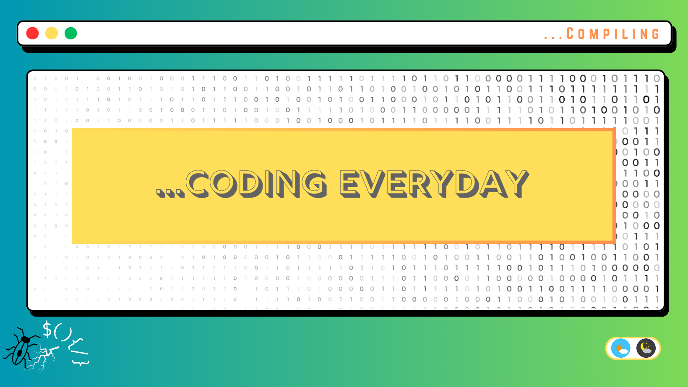
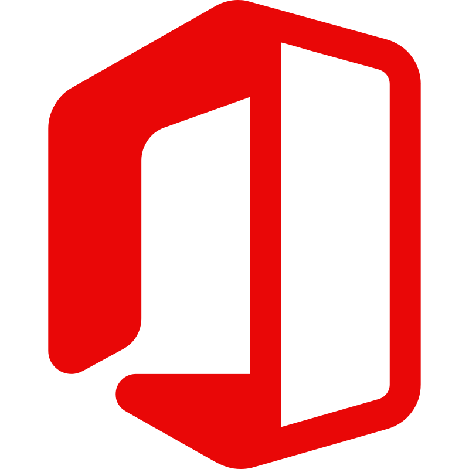
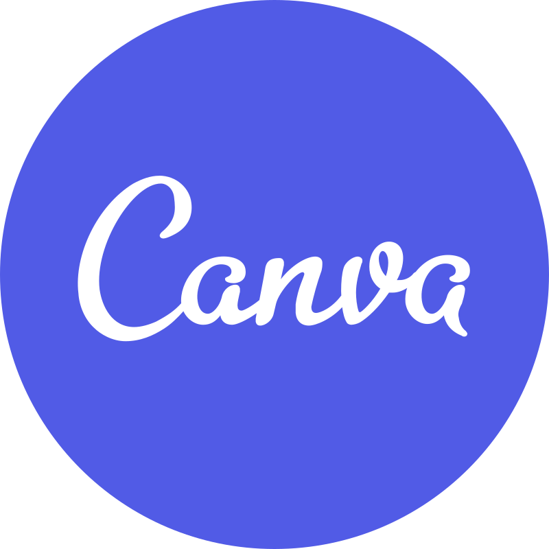

<!-- Banner Image Starting -->

<!-- Banner Image Ending -->

<h1 style="text-align:center; font-style:italic;color:lightyellow;text-transform:uppercase;">😊 I appreciate your visit !</h1>

## 👋 Hi, I'm Ahad Ali

An enthusiastic Web-Developer & Student. 
🏠 Living: Jamalpur, Bangladesh.

<!-- Contact  Me Starting --->
[][website]
[][facebook]
[][linkedin]
<!-- Contact  Me Ending --->

<!-- About ME Starting -->
### 👨🏻‍🏫 About Me :

I'm a passionate Web-Developer also a student.I am improving my web development skills. Every day I want to learn something new and share my knowledge with everyone.Also working as a part time Front-End web developer and a trainer at Unique IT, Bangladesh.

<!-- About ME Ending -->

<!-- My Skills Starting -->
### 👨🏻‍💻 My Skills :

<!-- My Skills Ending -->

 
 

<!-- Other Skills Starting -->
### 💻 Other Skill :

<!-- Other Skills Ending -->

 
 
 

<!-- GitHub Stats Starting -->

<!--  -->

<!-- GitHub Stats Ending -->

<!-- Important Links -->
[website]:comming-soon
[facebook]:https://www.facebook.com/ahad.dev01
[linkedin]:comming-soon