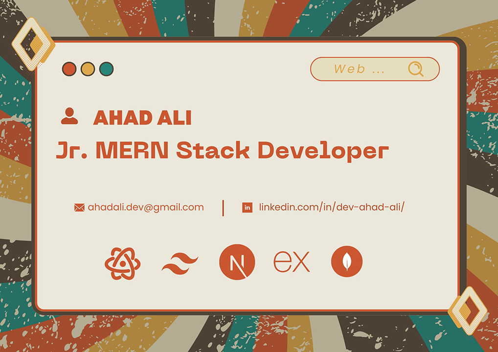

<!-- Banner Image -->

# 👋 Hello ! I'm Ahad Ali a passionate <b>WEB/M.E.R.N</b> Dev.

## 🤖 About Me :

I am a keen Web developer who is always looking to learn new and exciting technologies. Right now I'm skilled in <b>M.E.R.N</b> stack technologies such as <b>React.js and Redux/ReduxToolkit</b> for complex Frontend UI and state management to ensure a user-friendly experience. <b>TailwindCSS</b> and other libraries for styling and creating modern responsive websites. Familiarity with Backend technologies like <b>Node.js, Express.js, MongoDB/Mongoose</b>, using them to develop Restful APIs and execute other functionalities on the Backend for a complete web experience. I'm also comfortable working with a Full-stack framework <b>NEXT.Js</b>. I'm looking forward to contribute to your mission of creating innovative and immersive digital experiences.

<a style="display:flex; align-items: center; gap:5px; width: 200" href="https://dev-ahad-ali.netlify.app/" target="_blank">
    
    <i style="font-size: 25; font-weight:700">Portfolio</i>
  </a>

 

🎯 <b>Currently Learning</b> : Redux/ReduxToolkit... exploring it's core functionalities.

## 🔎 GitHub Overview :

 

## ⚙️ Skills and Technologies

   
  
  
   
   
  

## 📊 Top Languages :

 

## 📟 Projects :

### 🏠 Urban Oasis (An online real estate management platform)

- **Live site**: [Urban Oasis](https://urban-oasis-indev.web.app/)
- [Visit repo for more details.](https://github.com/dev-ahad-ali/urban-oasis-client).

### 💒 Dream Stay (A hotel room booking website)

- **Live site**: [Dream Stay](https://dream-stay-indev.web.app/)
- [Visit repo for more details.](https://github.com/dev-ahad-ali/dream-stay-client).

### 📦 Art Alley (A art listing website)

- **Live site**: [Art Alley](https://art-alley.web.app/)
- [Visit repo for more details.](https://github.com/dev-ahad-ali/art-alley-client).

## 🌐 Find me on:

 
  
  
  

📝Feel free to explore my repositories below and reach out if you're looking for an enthusiastic Web Developer I'm ready to bring creativity and a strong work ethic to your team.

 
