<!-- Banner Image -->

<table width="100%" align="center">
  <tr>
    <td align="left">
      
    </td>
    <td align="right">
      
    </td>
  </tr>
</table>

## 🤖 About Me :

A passionate **Programmer** and a equally passionate **Learner**. Currently working as a **Full Stack Web Developer**. Always looking to discover thoughtful and exciting technologies and topics. Crafting innovative and immersive digital experiences with a solid base so it can be scalable based on needs.

🎯 <b>Learning</b> : React Native app development ⚛️.
 
💫 <b>Interest</b> : Slowly but surely getting Rust-y 🦀.

## 🔎 GitHub Overview :

 

## ⚙️ Skills and Technologies

<table align="center" style="width:100%; border-collapse: collapse;">
  <tr>
    <td align="center" width="50%" style="padding: 15px; border-right: 1px solid #eaeaea;">
      <h3>Programming Languages</h3>
       
      
    </td>
    <td align="center" width="50%" style="padding: 15px;">
      <h3>Frameworks & Libraries</h3>
       
      
    </td>
  </tr>
  <tr>
    <td align="center" width="50%" style="padding: 15px; border-top: 1px solid #eaeaea; border-right: 1px solid #eaeaea;">
      <h3>Databases</h3>
      
      
    </td>
    <td align="center" width="50%" style="padding: 15px; border-top: 1px solid #eaeaea;">
      <h3>Tools</h3>
       
      
    </td>
  </tr>
</table>

## 📊 Language Usage:

 

## 📌 Featured Projects :

<table align="center" style="width:100%; border-collapse: collapse;">
  <tr>
    <td align="center" width="50%" style="padding: 15px; border-right: 1px solid #eaeaea;">
      <h3>👟 Foot Finesse</h3>
      
An online shoe selling platform

      

        🔗 <a href="https://foot-finesse-alpha.vercel.app/" target="_blank">Live Site</a> 
        📂 <a href="https://github.com/dev-ahad-ali/Foot-Finesse" target="_blank">View Repository</a>
      

    </td>
    <td align="center" width="50%" style="padding: 15px;">
      <h3>💒 Dream Stay</h3>
      
A hotel room booking website

      

        🔗 <a href="https://dream-stay-indev.web.app/" target="_blank">Live Site</a> 
        📂 <a href="https://github.com/dev-ahad-ali/dream-stay-client" target="_blank">View Repository</a>
      

    </td>
  </tr>
  <tr>
    <td align="center" width="50%" style="padding: 15px; border-top: 1px solid #eaeaea; border-right: 1px solid #eaeaea;">
      <h3>🏙️ Urban Oasis</h3>
      
An online real estate management platform

      

        🔗 <a href="https://urban-oasis-indev.web.app/" target="_blank">Live Site</a> 
        📂 <a href="https://github.com/dev-ahad-ali/urban-oasis-client" target="_blank">View Repository</a>
      

    </td>
    <td align="center" width="50%" style="padding: 15px; border-top: 1px solid #eaeaea;">
      <h3>🎨 Art Alley</h3>
      
An art listing website

      

        🔗 <a href="https://art-alley.web.app/" target="_blank">Live Site</a> 
        📂 <a href="https://github.com/dev-ahad-ali/art-alley-client" target="_blank">View Repository</a>
      

    </td>
  </tr>
</table>

## 🌐 Find me on:

 
  
  
  

📝Feel free to explore my repositories below and reach out if you're looking for an enthusiastic Programmer/Developer I'm ready to bring creativity and a strong work ethic to your team.

 
